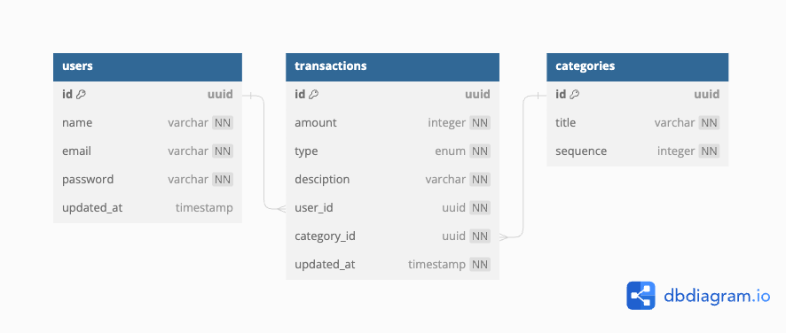
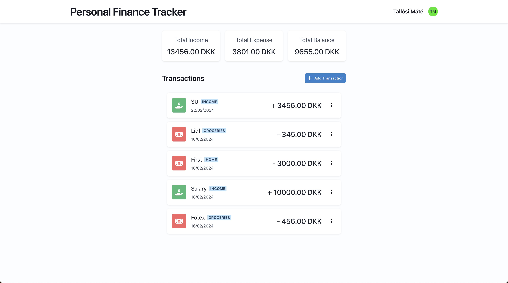

# Personal Finance Tracker

A simple personal finance tracker.

TL;DR:

```bash
docker-compose up --build
```

The application is built with the following technologies:

- Database: PostgreSQL
- API: Express.js (TypeScript)
- Frontend: React.js (TypeScript)
- Containerization: Docker
- Orchestration: Docker Compose
- Reverse Proxy: Nginx

## Database

The database is PostgreSQL. It contains the following tables:

- `users`
- `transactions`
- `categories`

The the fileds and the relationships between the tables are illustrated in the following diagram:



And the implementation of the database is available in the [database](./database) directory.

## API

The API is built with Express.js.

It contains the following endpoints:

- `POST /api/login`
- `POST /api/users`
- `GET /api/users/{id}`
- `PUT /api/users/{id}`
- `DELETE /api/users/{id}`
- `GET /api/transactions`
- `POST /api/transactions`
- `GET /api/transactions/{id}`
- `PUT /api/transactions/{id}`
- `DELETE /api/transactions/{id}`
- `GET /api/categories`
- `GET /api/categories/{id}`

The detailed documentation of the API is available in the OpenAPI format, which can be accessed after the API is running at the following URL via Swagger UI: [http://localhost:8000/api-docs](http://localhost:8000/api-docs).

The implementation of the API is available in the [backend](./backend) directory.

## Frontend

The frontend is built with React.js using Chakra UI for visual components.

It contains the following pages:

- `Login`
- `Signup`
- `Dashboard`

In the `Dashboard` page, the user can see the list of transactions and some statistics about the transactions. The user can also add, edit, and delete transactions.



Afret the frontend is running, it can be accessed at the following URL:

- In development: [http://localhost:3000](http://localhost:3000)
- In production: [http://localhost:8000](http://localhost:8000)

The implementation of the frontend is available in the [frontend](./frontend) directory.

## Development

### Prerequisites

- [Node.js](https://nodejs.org/)
- [yarn](https://yarnpkg.com/)
- [Docker](https://www.docker.com/)

### Database

Build the database with the following command:

```bash
cd database
docker build -t personal_finance_tracker_db .
```

Run the database with the following command:

```bash
docker run -e POSTGRES_PASSWORD=password -p 5432:5432 -d personal_finance_tracker_db
```

### API

Install the dependencies with the following command:

```bash
cd backend
yarn install
```

Run the API with the following command:

```bash
yarn dev
```

### Frontend

Install the dependencies with the following command:

```bash
cd frontend
yarn install
```

Run the frontend with the following command:

```bash
yarn start
```

## Deployment

### Prerequisites

- [Docker](https://www.docker.com/)
- [Docker Compose](https://docs.docker.com/compose/)

The API and the frontend are containerized with Docker. For each of them, the Dockerfile is available in the top-level directory.

A fourth Docker service, `nginx`, is used to serve the frontend and the API. The configuration of the `nginx` service is available in the [nginx](./nginx) directory.

To build and run the services, use the following commands:

```bash
docker-compose up --build
```
